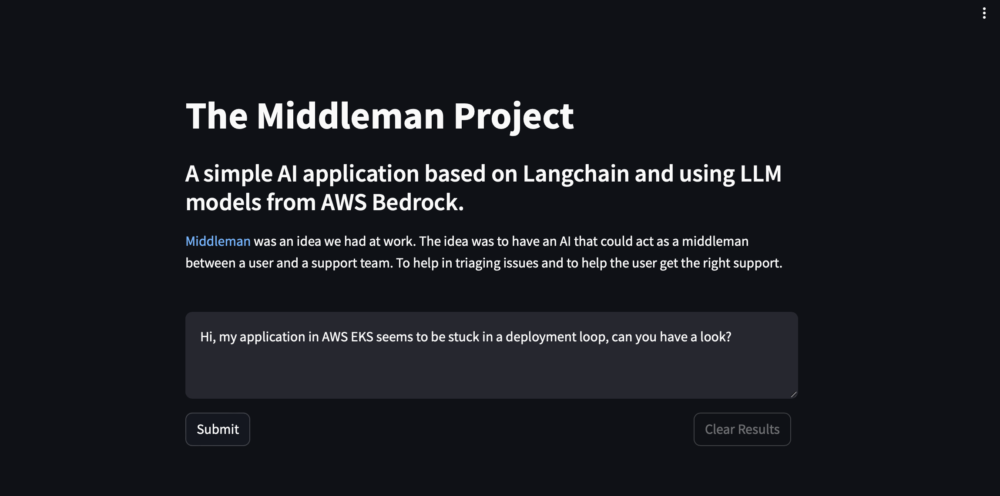

# Middleman Project

This is a Streamlit application that allows users to interact with a chat interface. Users can submit questions, and the application will generate responses. The application also includes a feature to clear the chat history.

## Local Development

Follow these steps to setup local development:

1. Clone the repository to your local machine using `git clone <repository-url>`.
2. Navigate to the project directory using `cd <project-directory>`.
3. Create a virtual environment `python3 -m venv .venv` or what ever you want.
4. Activate the environment `source .venv/bin/activate`
5. Install the required dependencies using `pip3 install -r requirements.txt`.

Or you can simply build the **Dockerfile** `docker build -t middleman .` and run the application in a development container. Note: the Dockerfile is not suitable for running in production, its just for local development.

## Running the Application Locally

You can run the application locally using the following command:

```bash
streamlit run main.py
```

Or 
```
docker run --rm -v ~/.aws:/root/.aws:ro middleman:latest

# note that you will also need to pass in your AWS credentials somehow
# we did it here by passing in our .aws directory
```

### Screenshot

